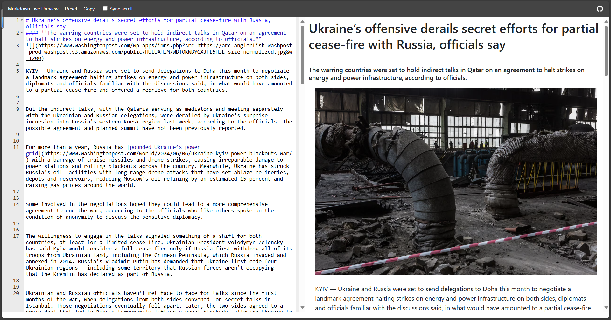

### **For learning purposes only.**

Note: Secondary pictures aren't supported because they are usually used in an canvas element.
Last Updated: 2025.3.2

To run the script:

- install packages in requirements.txt.
- set proxy in __main__.py if you're using any.
- run the script in the CLI (`python .`).
- Have fun!

Example output:

